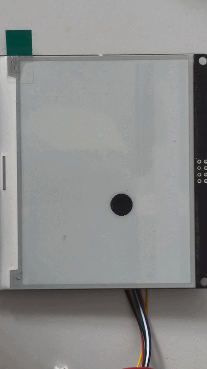

# SSD1683 fast partial refresh (custom waveform LUT)

A drop-in [GxEPD2](https://github.com/ZinggJM/GxEPD2) subclass that gives the
**WeAct 4.2" e-paper (Good Display GDEY042T81 / Solomon Systech SSD1683)** a
clean **~510 ms partial refresh** — about **half** the ~1050 ms you get from the
stock driver's built-in (OTP) waveform.

It does this by preloading a **fully custom 227-byte waveform LUT** into the
controller, instead of using the panel's factory waveform.

<p align="center">
  
  <br><em>The MovingCircle example: each step is a ~510 ms partial refresh.</em>
</p>

```
              partial refresh time (400x300, B/W)
  stock GxEPD2 (OTP waveform)   ###########################  ~1050 ms
  this library (custom LUT)     #############               ~510 ms
```

> **Status:** works, clean image, ~510 ms. This is a *fixed* duration on this
> code path (see [Limitations](#limitations)) — it does not yet reach Good
> Display's 0.35 s spec, but it's a solid, reproducible 2× speedup with a custom
> waveform, and the writeup below documents exactly how the SSD1683's custom-LUT
> path works (it's poorly documented elsewhere).

## Why this exists

The 4.2" panel is advertised with a **0.3 s partial refresh**, but in reality
you only get **~1 s** with GxEPD2. Smaller panels on the closely-related SSD1680
controller *do* reach a fast partial refresh, yet the 4.2" GDEY042T81 stays
around ~1 s. Hence this custom-LUT effort to bring it down to **~0.5 s**.

On the SSD1683, the obvious approaches to a faster partial refresh all fail in
confusing ways, and the controller's custom-LUT mechanism is barely documented.
This repo is the result of reverse-engineering it from the datasheet — so you
don't have to. Three things that are easy to get wrong:

1. **The B/W waveform LUT is 227 bytes**, not the 70-byte (Adafruit SSD1675) or
   153-byte (SSD1680) formats you'll find in sister-chip drivers. Writing a
   shorter LUT leaves the rest of the LUT register at stale/garbage values — the
   classic "multi-pass 3000 ms + dirty image" symptom.
2. **Command `0x22` bit 3 selects 3-color vs black/white waveform**, *not*
   "mode 1 vs mode 2 / single vs multi-pass" (a common misreading extrapolated
   from the SSD1681). Decoded from the datasheet's own example bytes
   (`0x91`/`0x99`, `0xC7`/`0xCF`, `0xF7`/`0xFF`).
3. **To actually drive a custom LUT you need `0x22 = 0xDC`** — `load_LUT` set
   (transfers *your* `0x32` register into the waveform sequencer) but
   `load_temp` **clear** (otherwise it reloads the factory OTP waveform over
   your register). Plus the booster soft-start (`0x0C`) and the companion
   voltage registers, or the charge pump never ramps and nothing moves.

The full recipe and the dead ends are in the
[header comments](src/GxEPD2_420_FAST_LUT_GDEY042T81.h) and
[How it works](#how-it-works).

## Hardware

| | |
| --- | --- |
| Panel | WeAct Studio 4.2" B/W e-paper, 400×300, **GDEY042T81** |
| Controller | Solomon Systech **SSD1683** |
| Verified MCU | Waveshare ESP32-S3 Nano (any ESP32/ESP8266/etc. with GxEPD2 should work) |
| Toolchain | Arduino IDE / arduino-cli with **GxEPD2** installed |

### Example wiring (from the demo sketch)

The panel is write-only over SPI (MISO unused). Pins below are what the example
uses on an ESP32-S3 Nano — adapt to your board:

| EPD pin | ESP32-S3 Nano | `#define` |
| --- | --- | --- |
| BUSY | D4  | `EPD_BUSY 4` |
| RST  | D3  | `EPD_RST 3` |
| DC   | D2  | `EPD_DC 2` |
| CS   | D10 | `EPD_CS 10` |
| SCL  | D13 | SPI SCK |
| SDA  | D11 | SPI MOSI |
| GND  | GND | — |
| VCC  | 3V3 | — |

## Install

This is a small Arduino library that depends on **GxEPD2**.

1. Install **GxEPD2** (Library Manager, by Jean-Marc Zingg).
2. Install this library: *Sketch → Include Library → Add .ZIP Library…* with a
   ZIP of this repo, or clone it into your Arduino `libraries/` folder.

## Usage

```cpp
#include <SPI.h>
#include <GxEPD2_BW.h>
#include <GxEPD2_420_FAST_LUT_GDEY042T81.h>

#define EPD_CS 10
#define EPD_DC 2
#define EPD_RST 3
#define EPD_BUSY 4

// Use the fast-LUT subclass in place of GxEPD2_420_GDEY042T81:
GxEPD2_BW<GxEPD2_420_FAST_LUT_GDEY042T81, GxEPD2_420_FAST_LUT_GDEY042T81::HEIGHT>
  display(GxEPD2_420_FAST_LUT_GDEY042T81(EPD_CS, EPD_DC, EPD_RST, EPD_BUSY));

void setup() {
  SPI.begin();
  display.init(115200, true, 2, false);
  // first update must be a full refresh:
  display.setFullWindow();
  display.firstPage();
  do { display.fillScreen(GxEPD_WHITE); } while (display.nextPage());
}

void loop() {
  // ...draw something into a region, then a fast partial refresh:
  display.setPartialWindow(0, 0, 200, 100);
  display.firstPage();
  do {
    display.fillScreen(GxEPD_WHITE);
    display.setCursor(10, 40);
    display.print(millis());
  } while (display.nextPage());        // ~510 ms, clean
  delay(1000);
}
```

Everything else is identical to using stock GxEPD2. Do an occasional full
refresh (`setFullWindow()`) to clear accumulated ghosting.

See [`examples/MovingCircle`](examples/MovingCircle/MovingCircle.ino) for a
self-contained benchmark that bounces a circle around the panel and prints each
partial-refresh time over Serial.

### Tip: run SPI at 20 MHz

The ~510 ms is a fixed waveform cost; the rest of a partial is the time to clock
the image data into the panel's RAM. The SSD1683 is rated for **20 MHz** SPI but
GxEPD2 defaults to 10 MHz, so bumping it shaves the data-transfer part (most
noticeable on large update regions). Add this once, after `display.init(...)`:

```cpp
#include <SPI.h>
display.epd2.selectSPI(SPI, SPISettings(20000000, MSBFIRST, SPI_MODE0));
```

20 MHz is the controller's rated maximum — don't go higher. If you see image
glitches (e.g. with long/marginal wiring), drop back to `10000000`.

## How it works

The custom-LUT partial-update sequence (after the initial full refresh):

1. **Soft-start** the booster: `0x0C 8B 9C A4 0F`.
2. **Write the 227-byte B/W waveform LUT** via `0x32`, then the companion
   voltage registers: `0x3F`=EOPT, `0x03`=VGH, `0x04`=VSH1/VSH2/VSL, `0x2C`=VCOM.
3. Set the partial RAM window (`0x11`,`0x44`,`0x45`,`0x4E`,`0x4F`).
4. **`0x21 00 00`** (display control 1), **`0x22 0xDC`**, **`0x20`** (activate).

`0x22` bit breakdown (from the datasheet's own example bytes):

| bit | 7 | 6 | 5 | 4 | 3 | 2 | 1 | 0 |
| --- | --- | --- | --- | --- | --- | --- | --- | --- |
| meaning | en clock | en analog | load_temp | load_LUT | 0=3-color / 1=B/W | display | dis analog | dis OSC |

So `0xDC` = `1101 1100` = clock + analog + **load_LUT** + **B/W** + display, with
**load_temp off**. The stock partial uses `0xFC` (adds load_temp), which is why
stock always falls back to the factory OTP waveform.

The 227-byte LUT itself (datasheet Fig 6-7) is 5 LUTs × 6 groups × 7 bytes +
trailing FR/XON. This library uses a single drive phase per LUT and a **direct
(non-differential) drive** — every pixel is driven to its current value, so it
doesn't depend on the controller's previous-frame RAM. Voltage levels per phase
are 2 bits (`VSS`/`VSH1`/`VSL`/`VSH2`).

## Limitations

- **~510 ms is a fixed floor on this path.** Per-phase frame count (`TP`) and the
  frame-rate (`FR`) byte do **not** change it — verified by sweeping both. The
  controller honors the LUT's *voltage levels* but runs a fixed-duration
  waveform when `load_LUT` is used. A different (non-`load_LUT`) drive runs a
  shorter waveform but doesn't energize the panel. If you find a way past this,
  PRs very welcome.
- **No temperature compensation.** Voltages are borrowed from GxEPD2_4G's LUT for
  this panel and render cleanly at room temperature; behaviour at temperature
  extremes is uncharacterised.
- **DC-unbalanced single phase** — fine with an occasional full refresh; if you
  see ghosting build up, full-refresh more often.
- Verified on one panel + one MCU (ESP32-S3 Nano). Other SSD1683 panels probably
  work but may want different voltages or MUX. Reports welcome.

## Credits

- Built on **[GxEPD2](https://github.com/ZinggJM/GxEPD2)** by Jean-Marc Zingg
  (GPL-3.0) — this subclasses its `GxEPD2_420_GDEY042T81` driver, and the
  soft-start / drive-voltage bytes come from its `GxEPD2_4G` 4-grayscale LUT for
  this panel.
- SSD1683 datasheet (Solomon Systech, Rev 1.0).
- This work is a little side project while working on a bigger one (not yet
  released). Creating this custom LUT wouldn't have been possible without Claude
  — my own knowledge of how EPDs work is very limited, and I certainly wouldn't
  have succeeded in making a custom LUT without an AI (the paid version of Claude
  was used).

## License

**GPL-3.0-or-later** — see [LICENSE](LICENSE). (Required: this is a derivative
work of GPL-3.0 GxEPD2.)
